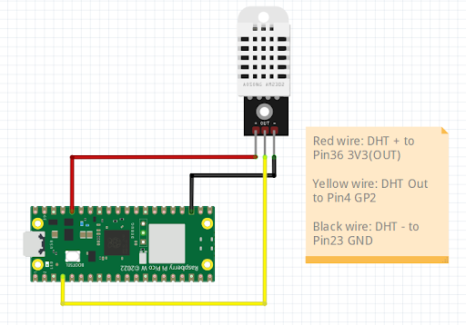

# Raspberry Pi Pico W with Home Assistant server
This kit is ideal for beginners that need a base to start testing their projects. We include a USB cable for programming/testing your Pico projects and an official power supply for when you deploy your Pico to perform it's duties.
The code was designed to work with the [Pico W DHT22 kit](https://www.pishop.co.za/index.php?source=official-github-20221220&referral=https%3A%2F%2Fwww.pishop.co.za%2Fstore%2Fraspberry-pi-pico-w-pre-soldered-headers-maker-kit-4-with-breadboard-parts-2632) Found at PiShop SA. But can get you started displaying any sensor data using your RP Pico W

 We'll show you how on our blog pages.

How to [use your Pico as a webpage server](https://blog.pishop.co.za/raspberry-pi-pico-w-as-a-web-server/) displaying sensor data.

How to [use your Pico to serve JSON data to Home Assistant](https://blog.pishop.co.za/using-raspberry-pi-pico-w-with-home-assistant/) on request.

We also stock a wide selection of [sensors](https://www.pishop.co.za/store/sensors) and [boards](https://www.pishop.co.za/store/raspberry-pi-pico_0) that you can use to upgrade your Pico W project.

### What's in the repo: 

#### Section 1
- Home Assistant setup
- RP Pico W Code for Home assistant

#### Section 2
- RP Pico W Code to serve a Web Server

### Index or Table of Contents

- [Section 1](#section1)
    - [Features](#features)
    - [Tech Stack](#tech-stack)
    - [Network Configuration](#network-configuration)
- [Section 2](#section2)
    - [Features](#features)
    - [Tech Stack](#tech-stack)
    - [Network Configuration](#network-configuration)
- [How to run](#how-to-run)
- [To Do](#to-do)
- [Changelog](#changelog)
- [Contributing](#contributing)

## Section 1
````mermaid
sequenceDiagram
    autonumber
    title Home assistant
    RP Pico W->>Home assistant: Listen for call
    loop Every 10 Seconds
        RP Pico W->>Sensor: Read Temp+Hum
        Sensor -->>RP Pico W: Respond Temp+Hum
        Home assistant->>RP Pico W: Request
        RP Pico W->>Home assistant: Respond
    end 
````
### Features
- .yml file contains setup configuration for HA to call the Pico and display the readings. Do not replace the Home Assistant configuration.yaml file with this one. Simply add the configuration lines to the existing file on Home Assistant. [Read more](https://www.home-assistant.io/docs/configuration/)
- main.py listens for call from HA and responds with json structured temperature and humidity readings received from the DHT sensor.

### Tech Stack:
- Home Assistant configuration
- Pico Code for web server

### Network Configuration
- Follow [How to run](#how-to-run) below
- update main.py line 23 with your static IP, Subnet Mask for IP Network, router IP and DNS. The subnet mask 255.255.255.0 address is the most common subnet mask used on computers connected to Internet Protocol (IPv4) networks. '8.8.8.8' is the Google Public DNS.
````bash
wlan.ifconfig(('10.0.0.94', '255.255.255.0', '10.0.0.2', '8.8.8.8')) 
````
- update main.py line 25 with your SSID and password to your network
````bash
wlan.connect("mySSID", "myPASSWORD") 
````

## Section 2

````mermaid
sequenceDiagram
    autonumber
    title Web Server
    loop Every 10 Seconds
        RP Pico W->>Sensor: Read Temp+Hum
        Sensor -->>RP Pico W: Respond Temp+Hum
        RP Pico W->>Web: Send html
   end
````

### Features

- main.py serves a simple web page on a static page displaying the sensor readings

### Tech Stack:
- Pico Code to configure a web server

### Network Configuration
- Follow [How to run](#how-to-run) below
- update main.py line 28 with your static IP, Subnet Mask for IP Network, router IP and DNS. The subnet mask 255.255.255.0 address is the most common subnet mask used on computers connected to Internet Protocol (IPv4) networks. '8.8.8.8' is the Google Public DNS. 
````bash
wlan.ifconfig(('10.0.0.94', '255.255.255.0', '10.0.0.2', '8.8.8.8')) 
````
- update main.py line 30 with your SSID and password to your network
````bash
wlan.connect("mySSID", "myPASSWORD") 
````

### How to run
- Connect your sensor

- Clone the code
````bash
git clone https://github.com/pishop-io/rp-pico-w-ha
````
- Ensure network, dht and machine are install on Thonny
    - [Installing Python packages](https://projects.raspberrypi.org/en/projects/install-python-packages/2)
- OR
````bash
pip install dht
pip install network
````
- Save main.py to Raspberry Pi Pico W

### Contact:
- support@pishop.africa

### Disclaimer:
- This code example is intended for educational purposes only. It is not intended to be used in production environments.